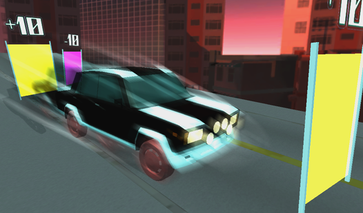

##### Название проекта: 
# Car time runner 2024

##### Ссылка на игру

https://yandex.ru/games/app/359734?lang=ru

##### Описание проекта

Игра из себя представляет казуальную одиночную гонку, где нужно, управляя автомобилем, доехать до финиша раньше, чем закончится время. Есть разные уровни, каждый из которых представляет из себя дорогу с расставленными на ней гаражами и воротами. Проезд через ворота добавляет или отнимает время, проезд через гараж отнимает время, но взамен дает другую машину, как правило быстрее. Управление реализовано как под PC, так и под мобильные устройства. Игра выпущена на площадку Яндекс игр.

##### В игре реализовано 

- Основные игровые механики - физика автомобиля и его управление, таймер, изменение времени при проезде через ворота, смена машины при проезде через гараж, возврат на трассу при падении;
- Мета механики - главное меню, загрузка трасс, экраны победы и поражения, покупка уровней, лидерборды, магазин;
- 9 различных уровней с 3 разными тематиками (у каждого уровня свои элементы окружения, музыка и скайбокс);
- Самодельная  система паузы;
- Самодельная система анимации UI;
- Самодельная система игровых настроек (звук, положение камеры);
- Внутриигровая валюта и магазин, где возможно ее покупать (связали с Яндекс SDK, но в теории там достаточно абстрактно, чтобы на любую платформу это перенести, только бэкенд нужен будет);

##### Техническая часть

- Используется единая точка входа, причем в проект, так что запускается с любой сцены;
- Есть самописный простой DI контейнер;
- Геймплей написан на стейт машине;
- Есть самописный простой компонентный фреймворк для анимации UI;
- Многие системы написаны на абстракциях и могут подменять детали реализации - есть потенциал для выпуска на другие платформы;
- Большинство сущностей (особенно касается связок логики и отображения) связаны друг с другом событиями через медиатор (медиаторы конкретные, без абстракций);
- Проведена работа по внедрению Яндекс SDK при помощи PluginYG: разметка геймплея, показ рекламы, покупка внутриигровой валюты, лидерборды;

##### Что ещё планируется сделать в игре

Гибкость архитектуры проекта позволяет в будущем дополнять функционал игры:

- Сделать ещё несколько уровней с другими тематиками;
- Добавить машин;
- Добавить кастомизацию колес;
- Добавить скины для автомобилей;
- Возможно немного перебалансировать стоимость уровней и награду за прохождения уровней;

##### Разработчики
- **Milt** (tg: @prostomilt) - идея проекта
- **TheEvilDuck** (tg: @Sheldone) - роли техлида и тимлида, геймдизайн, код, графика, музыка, уровни: boxheaddyamonag@gmail.com
- **Sever** (tg: @SlvtF) - код и уровни: salavatfattahov@gmail.com
